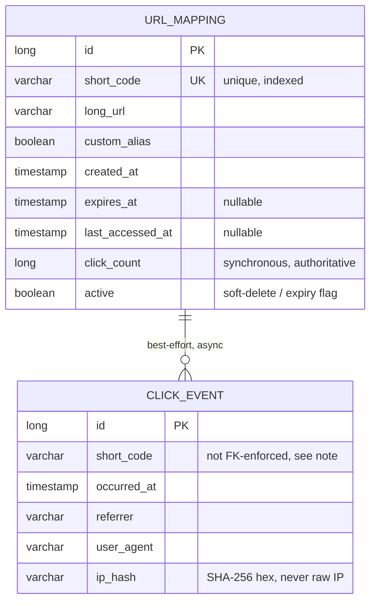

# Architecture

## 1. Component overview

```mermaid
flowchart TB
    subgraph Client
        C[HTTP client / browser]
    end

    subgraph "Spring Boot process (single JVM)"
        RC[RedirectController<br/>GET /{code}]
        UC[UrlController<br/>/api/v1/urls]
        AC[AnalyticsController<br/>/api/v1/urls/{code}/analytics]
        GEH[GlobalExceptionHandler]
        RLI[RateLimitInterceptor]

        US[UrlService]
        CULS[CachedUrlLookupService]
        AS[AnalyticsService]
        CES[ClickEventService<br/>@Async]
        SCG[ShortCodeGenerator]

        CACHE[(Caffeine cache<br/>code → UrlMapping)]
        RLR[RateLimiterRegistry<br/>ConcurrentHashMap of TokenBuckets]

        UMR[(UrlMappingRepository)]
        CER[(ClickEventRepository)]

        SCHED[CleanupScheduler<br/>@Scheduled]
    end

    subgraph Storage
        H2[(H2 file DB<br/>./data/urlshortener)]
    end

    C -->|POST create| RLI --> UC
    C -->|GET redirect| RC
    C -->|GET analytics/metadata| AC & UC

    UC --> US
    RC --> US
    AC --> AS

    US --> CULS --> CACHE
    CULS --> UMR
    US --> UMR
    US --> SCG
    RC -.->|fire-and-forget| CES
    CES --> CER
    AS --> CER
    AS --> UMR

    UMR --> H2
    CER --> H2

    RLI --> RLR

    SCHED --> UMR
    SCHED --> RLR

    UC & RC & AC -.exceptions.-> GEH
```

Every box above lives in one JVM. There is no network hop between "app" and "cache" or "app" and
"rate limiter" — both are in-process data structures. The only network/IO boundary is the H2 file
on local disk.

## 2. Request flows

### 2.1 Create a short URL — `POST /api/v1/urls`

1. `RateLimitInterceptor` consumes one token from the caller's bucket (keyed by
   `X-Forwarded-For` or `remoteAddr`); throws `RateLimitExceededException` (→ 429) if exhausted.
   GET requests bypass this interceptor path entirely — see §4.3.
2. `UrlController` validates the request body (Bean Validation: `longUrl` required, `ttlSeconds`
   positive if present) and delegates to `UrlService.createShortUrl`.
3. `UrlValidator.validate(longUrl)` enforces the scheme allowlist and SSRF guard (§4.5).
4. Two paths:
   - **Custom alias**: check `UrlValidator.isReservedPath` (→ 400 if reserved), then
     `repository.existsByShortCode` (→ 409 `AliasConflictException` if taken), then insert directly.
   - **Generated code**: two-phase insert — insert a row with a unique UUID placeholder as
     `shortCode` (satisfies the `NOT NULL UNIQUE` constraint and gets a DB identity via
     `saveAndFlush`), then `ShortCodeGenerator.generate(id)` derives the real code from that
     identity and a second `save` overwrites the placeholder. This avoids a collision-retry loop
     entirely — see §4.1 for why.
5. Response: `201 Created` with the short code, absolute short URL, and metadata.

### 2.2 Redirect — `GET /{code}`

1. `RedirectController` calls `UrlService.resolveForRedirect(code)`.
2. That calls `CachedUrlLookupService.findActiveByShortCode(code)` — a `@Cacheable` lookup
   (Caffeine, 5-minute TTL, 10k-entry cap) that returns the raw `UrlMapping` or `null`. This is
   the only part of the read that's cached.
3. `UrlService` then checks `mapping.isExpired(now)` **unconditionally, on every call, cache hit
   or miss** — never inside the cached method. If expired → `410 Gone`. If missing → `404`.
4. On success: `UrlService.recordClick(code)` issues an atomic
   `UPDATE ... SET click_count = click_count + 1, last_accessed_at = ? WHERE short_code = ?`
   (synchronous, in the request transaction) — this is the number returned by
   `GET /api/v1/urls/{code}` and by `analytics.totalClicks`.
5. Separately, `ClickEventService.recordAsync(...)` (`@Async`, its own `REQUIRES_NEW`
   transaction) persists a `ClickEvent` row (referrer, user agent, SHA-256-hashed IP) for
   analytics breakdowns. This runs off the request thread; its failure is logged and swallowed,
   never propagated to the client.
6. Controller returns `302 Found` with `Location: <longUrl>`.

### 2.3 Analytics — `GET /api/v1/urls/{code}/analytics`

`AnalyticsService.getAnalytics(code)`:
- `totalClicks` comes from `UrlMapping.clickCount` (the authoritative, synchronous counter from
  §2.2 step 4) — **not** a `COUNT(*)` over `click_event`.
- `clicksByDay`, `topReferrers`, `topUserAgents` come from `ClickEventRepository`, fetched over a
  30-day lookback window and aggregated in Java (`Collectors.groupingBy`), capped at the top 10
  referrers/user-agents.

This split is deliberate — see §4.4 and `docs/RISKS.md`.

### 2.4 Delete — `DELETE /api/v1/urls/{code}`

Soft delete only: `UrlMapping.active` is flipped to `false` and saved; the row (and its click
history) is never removed. The Caffeine cache entry for that code is explicitly evicted
(`@CacheEvict`) in the same call, so a deleted code can't keep redirecting from a stale cache hit.

## 3. Data model



`click_event.short_code` is a plain column, not a JPA-managed foreign key, precisely because the
async writer must never fail (or block) on a referential-integrity join back to a row that could
theoretically already be gone; the relationship is logical, not enforced.

## 4. Key decisions and trade-offs

### 4.1 Short code generation: encode identity, don't generate-and-retry

A common naive approach is "generate N random base62 characters, retry on collision." Rejected:
under load, collision probability rises with table size, and every retry is a wasted round trip.
Instead: insert first (DB assigns a unique identity), then deterministically derive the code from
that identity via Base62 encoding XORed with a fixed mask (to avoid an obviously-sequential
`1, 2, 3...` public code). This is collision-free by construction and costs exactly one extra
`UPDATE` per creation — no retry loop, no contention.

*Trade-off, accepted and documented*: codes are still technically enumerable if an attacker
brute-forces the mask (a static, compiled-in constant — this is obfuscation, not security). For a
prototype this is an acceptable trade against implementation complexity; a hardened version would
add a random per-deployment salt or move to a proper Hashids/Sqids scheme. Custom aliases bypass
this entirely and are used verbatim.

### 4.2 Cache vs. expiry correctness

Initial design cached the *entire* `resolveForRedirect` method, including the expiry check. Bug:
`@Cacheable` skips re-executing the method body on a hit, so a mapping cached while still valid
would keep being served as valid — via `302`, not `410` — for up to the cache's full TTL after
its real `expiresAt` had passed. Fixed by splitting the cacheable unit (`CachedUrlLookupService`,
which caches only the immutable-at-cache-time DB row) from the expiry check (`UrlService`, which
re-evaluates `isExpired()` against the current clock on every single call, cached or not). See
`docs/AI_ASSISTED_ENGINEERING.md` for this as a traceable self-caught defect.

### 4.3 Click counting vs. concurrency

Initial design mutated the `UrlMapping` object returned from the cached lookup directly
(`mapping.recordClick(); repository.save(mapping)`), then relied on JPA to flush the change.
Bug: a Caffeine cache can return the *same object instance* to multiple concurrent redirect
threads; a non-atomic read-increment-write on a shared object under concurrent access loses
updates (classic lost-update race). Fixed with an atomic `@Modifying @Query` UPDATE
(`click_count = click_count + 1`) executed directly against the row, independent of whatever
object any thread happens to be holding.

### 4.4 Rate limiting scope

The interceptor only rate-limits `POST /api/v1/urls`; `GET /{code}` (the redirect hot path) is
explicitly exempt. Rate-limiting the redirect path would defeat the point of a URL shortener for
any link that goes viral or gets embedded somewhere high-traffic — the abuse surface worth
protecting is *creation* (spam/flooding the table), not *consumption*.

### 4.5 Validation and SSRF guard

`UrlValidator` enforces: scheme must be `http`/`https` (rejects `javascript:`, `data:`, `file:`,
`ftp:`); the resolved host must not be a loopback, private (RFC 1918), or link-local address
(blocks SSRF attempts to make the *server* fetch/redirect into its own internal network); and the
short code/alias must not collide with a reserved path (`api`, `actuator`, `swagger-ui`, `v3`,
`h2-console`, `favicon.ico`, `error`) that the routing layer already owns.

### 4.6 Analytics: split authoritative totals from best-effort breakdowns

Originally `totalClicks` was a `COUNT(*)` over the async `click_event` table — which could
under-report if an async write was ever lost (process crash, `@Async` thread pool saturation).
Fixed by sourcing `totalClicks` from the synchronous, atomically-updated `UrlMapping.clickCount`
directly; only the *breakdowns* (which inherently need per-event detail that isn't worth writing
synchronously on the redirect hot path) remain best-effort. This means `totalClicks` and
`sum(clicksByDay[*].count)` can, in rare cases, disagree slightly — documented, not hidden, in
`docs/RISKS.md`.

### 4.7 Why no Redis / external cache or queue

The execution environment for this exercise has no Docker and a plain Maven toolchain. Rather
than requiring infrastructure the grader would need to stand up, every cross-cutting concern that
would normally reach for Redis (cache, rate-limit bucket storage) is implemented in-process
instead, with the single-node limitation called out explicitly (`docs/RISKS.md`) rather than
silently assumed away. The abstractions (`CachedUrlLookupService`, `RateLimiterRegistry`) are
narrow enough that swapping the backing store for Redis later is a contained change, not a
rewrite.

### 4.8 Housekeeping instead of unbounded growth

Two `@Scheduled` jobs exist for the same reason: an in-memory or growing-forever resource is a
latent outage. `CleanupScheduler.deactivateExpiredUrls` (default every 5 minutes) flips `active`
to `false` for any TTL'd row past its `expiresAt`, so a redirect against a since-expired code
returns `404` (already deactivated) rather than relying on every single reader to notice the
expiry itself. `evictIdleRateLimitBuckets` (default every 10 minutes) removes token buckets for
clients that haven't made a request recently, bounding the `RateLimiterRegistry` map, which would
otherwise grow by one entry per distinct client IP forever.
